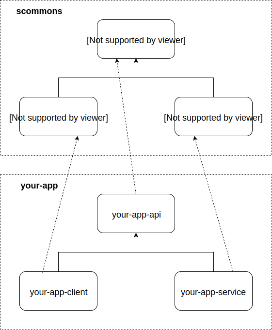

Welcome to the **Scala Commons** web site!

Visit [Showcase Demo UI](https://scommons.org/scommons-client/showcase/)
to see and try all the web-components live.

### Overview

scommons modules splitted into the following repos:

- [sbt-scommons-plugin](https://scommons.org/sbt-scommons-plugin/)
- [scommons-nodejs](https://github.com/scommons/scommons-nodejs)
- [scommons-websql](https://github.com/scommons/scommons-websql)
- [scommons-api](https://scommons.org/scommons-api/)
- [scommons-react](https://scommons.org/scommons-react/)
- [scommons-react-native](https://scommons.org/scommons-react-native/)
- [scommons-client](https://scommons.org/scommons-client/)
- [scommons-service](https://github.com/scommons/scommons-service)

Your application can depend on them accordingly:

[Preview](https://www.draw.io/?chrome=0&lightbox=1&url=https%3A%2F%2Fraw.githubusercontent.com%2Fscommons%2Fscommons.github.io%2Fmaster%2Fdrawio%2Foverview.svg%3Ft%3D0) | [Edit](https://www.draw.io/?title=overview.svg&url=https%3A%2F%2Fraw.githubusercontent.com%2Fscommons%2Fscommons.github.io%2Fmaster%2Fdrawio%2Foverview.svg%3Ft%3D0)

### Real World Applications

List of apps that use scommons modules:

- [scommons-admin](https://scommons.org/scommons-admin/)
- [farclone](https://github.com/scommons/farclone)

### Example Applications

Here are links to different projects that use **scommons** components/modules:

- [Showcase Demo UI](https://scommons.org/scommons-client/showcase/)
- [Web Applications](https://scommons.org/scommons-examples/)
- [Mobile Applications](https://scommons.org/scommons-examples-mobile/)
